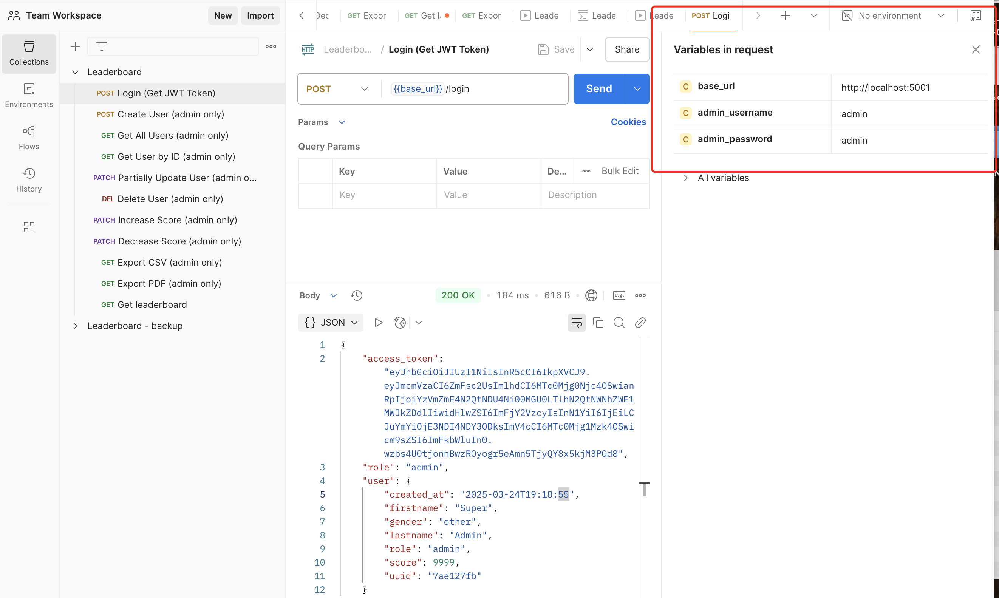
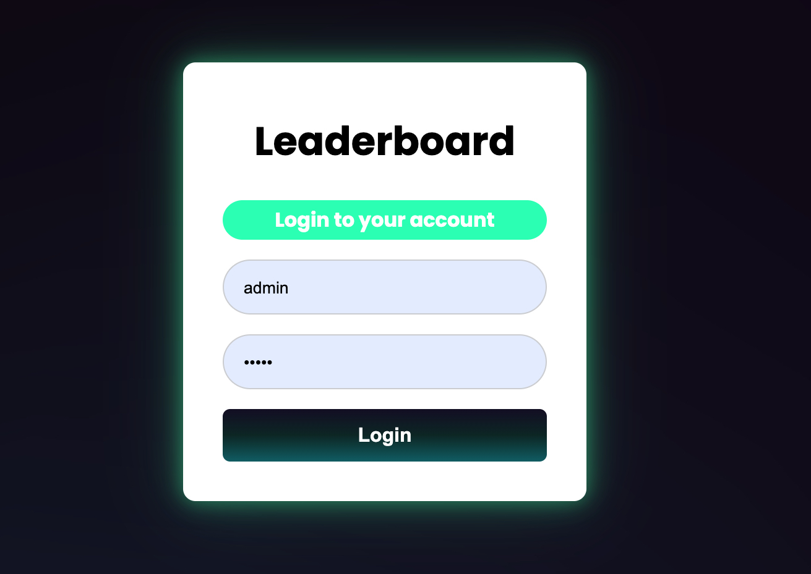
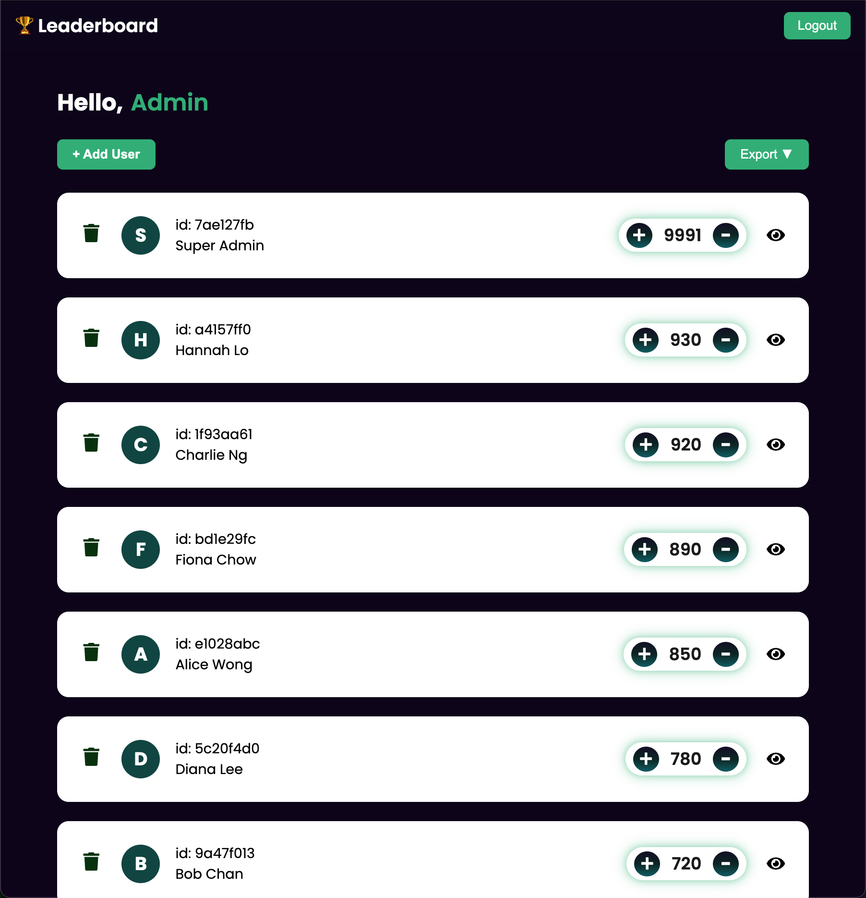
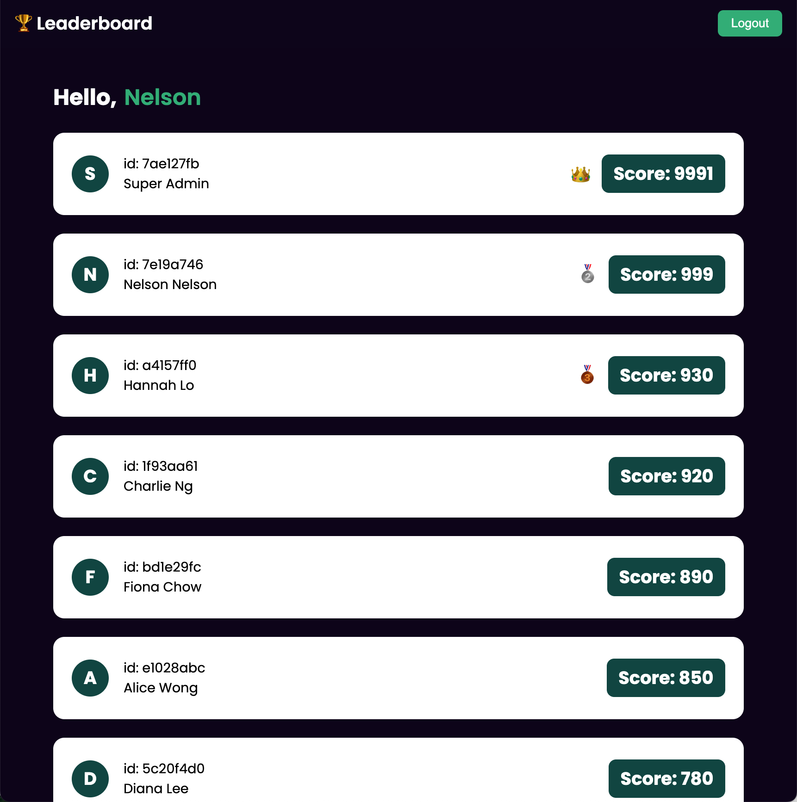
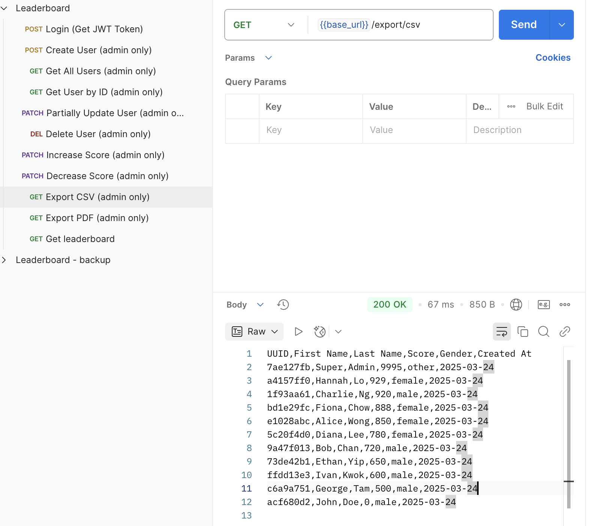
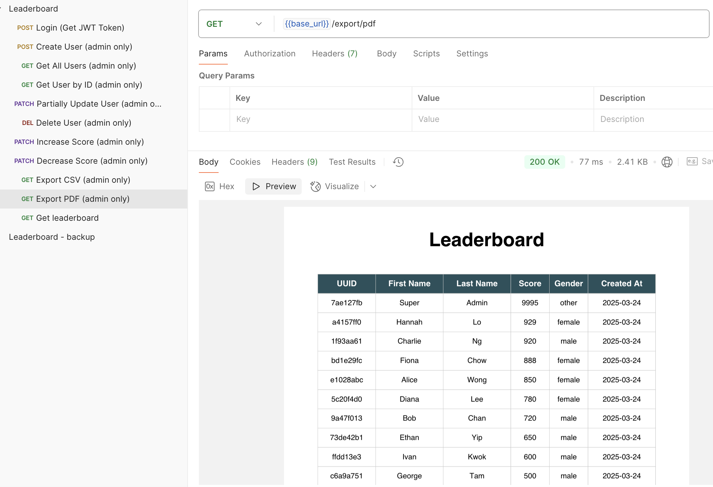

# 🏆 Leaderboard App

This is a full-stack leaderboard web application built with **Flask** (backend), **React + Vite** (frontend), **MySQL**, **Redis**, and **Celery**. It supports real-time leaderboard updates via **WebSockets**, user authentication with **JWT**, and is fully Dockerized for easy local development.

---

## 🚀 Features

- Admin/user roles with JWT authentication
- Real-time leaderboard updates via WebSocket
- Admin CRUD operations and data export (CSV, PDF)
- **Asynchronous event logging using Celery + Redis, stored in MySQL**
- Docker-based local development with services for frontend, backend, MySQL, Redis, and Celery

---

## 🧰 Tech Stack

- **Frontend:** React 19, Vite, TypeScript, Socket.IO
- **Backend:** Python, Flask, SQLAlchemy, Celery, Redis
- **Database:** MySQL 8
- **Async Task Queue:** Redis + Celery
- **Asynchronous event logging** using **Celery + Redis**
- **DevOps:** Docker, Docker Compose

---

## 📮 API Documentation (Postman)
### You can test the API using the provided Postman Collection.

Open Postman and import the file (Included in the repo):
[Leaderboard.postman_collection.json](https://raw.githubusercontent.com/Chiwai15/leaderboard/refs/heads/main/Leaderboard.postman_collection.json)<br />

Configure your variables in postman



## 🧑‍💻 Getting Started

### 🏞️ Preview






### 📦 Prerequisites

Make sure you have the following installed:

- [Docker](https://www.docker.com/)
- [Docker Compose](https://docs.docker.com/compose/)

---

### 📁 Project Structure

```bash
.
├── backend/         # Flask backend
├── frontend/        # React frontend (Vite)
├── .env             # Environment variables
├── docker-compose.yml
```

---
## ⚙️ Setup (with Docker)
### 1. Clone the repository
```bash
git clone <your-repo-url>
cd <project-folder>
```

### 2. Copy and configure environment variables
```bash
cp .env.example .env
# Edit .env if needed (e.g., DB password, secret keys)
```

### 3. Build and start all services
```bash
docker-compose up --build
```

### 4. Access the app
```bash
Frontend: http://localhost:5173

Backend API: http://localhost:5001

MySQL: localhost:3306
user: root
password: root 

First super user would be generated
user: admin
password: amdin 
```

### 5. A default superuser will be created automatically on first run:
```bash
Username: admin  
Password: admin
```
You can customize these credentials in the .env file:
```bash
ADMIN_USERNAME=admin
ADMIN_PASSWORD=admin
```

## 🗑 Clean up
### Stop and remove all containers, networks, and volumes:
```bash
docker-compose down -v
```